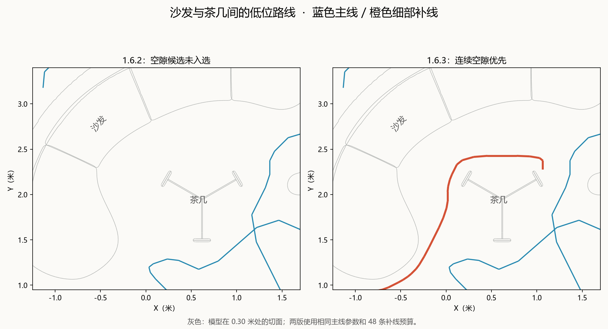

# 1.6.3：沙发与茶几间低位空隙补线

## 定位结果

当前场景与用户截图对应的茶几为 `StaticMeshActor213`，地毯为 `StaticMeshActor198`。4 个视图中取样的空隙位置都通过低位净距检查，其附近已有可达通行点。1.6.2 还曾产生一条约 3.26 米、覆盖 37 个缺口节点的候选线，但它在最终预算选择中落选。

这次保留主线与净距设置，修改细部候选与预算分配：

- 每层约一半预算先按新增空隙覆盖选择连续路线，避免连续空隙被大量表面采样收益挤掉。
- 提取最长路线后继续检查剩余支路，不用一条线代表整片复杂缺口。
- 已选路线与普通细部短线共同参与空间去重；空间覆盖和表面双视角收益分别记录。

## 当前场景对照

总细部预算仍为 48 条。本次输出 12 条主线和 48 条细部线。主线坐标与 1.6.2 逐点一致。

固定验证区域取 X = -0.45–1.20 m、Y = 1.40–2.90 m、低位 Z = 0.10–0.50 m 内的安全通行节点；按同一张 0.15 m 通行图，沿图距路线不超过 0.28 m 计算。原有路线覆盖 **3/55（5.5%）**，新版覆盖 **34/55（61.8%）**。

此区域只用于验证，算法没有引用这些坐标、家具名称或截图位置。

## 分层采样表面观察

| 高度 | 1.6.2 补线后 | 1.6.3 补线后 | 新版细部线数 |
| --- | ---: | ---: | ---: |
| 低层 | 94.34% | 95.26% | 16 |
| 中层 | 98.13% | 97.88% | 16 |
| 顶层 | 98.63% | 98.47% | 16 |

新版统计 133,417 个候选可观察的“高度层＋表面”单元，补线后仍有 3,449 个未满足双视角条件。表面指标不等同于整个模型覆盖或最终相机视场；上面的局部通行节点指标也不等同于实际重建质量。

## 验证与文件

- 16 项纯算法测试通过，含缺口支路、隔层保护及表面高分挤占空隙预算的回归测试。
- Blender 细部补线、低位空隙、顶层净空、重复生成、后台追加和取消任务验证通过。
- [安装包](../../releases/blender_gs_colmap_exporter-1.6.3-pocket-priority-routing.zip)
- 本地工作区 `validation_1.6.3/Luna_pocket_priority_preview.blend`：仅含新曲线集合的追加文件，未上传仓库。
- 本地工作区 `validation_1.6.3/luna_release_result.json`：新曲线坐标及完整报告，未上传仓库。
- [comparison.json](comparison.json)：固定局部通行节点的前后对照。其中 `new_gap_cells` 在新版也统计普通细部短线的空间收益，与旧版计数不能直接比较。

原场景未保存覆盖。当前运行的旧插件不会自动热替换，安装新版 ZIP 后才能重新生成同样的新算法结果。
